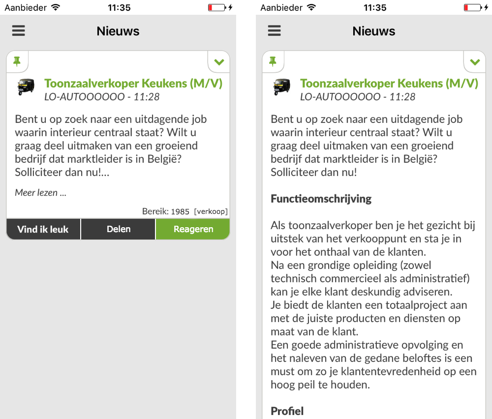

# GOAL

A separate stream for local job offers, next to the news & actions stream.

# Description

### Creating a job offer (OCA dashboard)

Merchants will have to possibility to enable the JOBS functionality in their OCA dashboard. When enabled, merchants will be able to create job offers in their dashboard, similar to creating news articles. When creating a job offer, a region has to be selected. They also have to complete some small surveys. The results will be used to match with Job profiles. Job profiles are discussed later in this document.

Merchants must be able to see how many people are looking for a job in their supported app(s). Merchants must also be able to choose to post and/or handle the screening of incoming job applications themselves, or to let a recruiter (Eg. It's Me) handle posting and/or handling screening of incoming job applications.

### The jobs stream (City app)

In the city apps we want to add the Jobs stream to the sidebar menu under the News stream.

In this stream the user needs to be able to say "I am looking for a new job". The user will need to complete some little surveys to complete his "Job profile". The surveys will be about his skills, values and personality (who am I, what are my skills, what would I like to do) and will also define which kind of jobs he wants to do. It must be possible for the user to redo the surveys at any time. This will affect the sort order of future job offers. The progress or completeness of the surveys needs to be visible somewhere in the app (TBD: profile page? job stream?)

Job offers will be sorted in the job stream based on the user's "Job profile". The job offers that match best with the user's Job profile will be shown on higher in the feed than the jobs that matched less with the user's Job profile.

Job offers will have the same look as regular news articles. It must be possible to pin them too, such that you can easily revisit those later. There will be 3 buttons at the bottom of a job offer: `Like` | `Share` | `Respond`.
- Liking will mention your name at the top of the job offer, like regular news articles. However, it won't influence the sort order.
- Sharing will give the user the possibility to share the job offer on Facebook (must be possible in the regular news feed too), or to recommend it to a friend in the city app.
- The Respond button is used to react to a job offer.

Example of a Dutch job ad with the `Read more` button (left) and after pressing the `Read more` button (right)

### Responding to a job offer (City app)

When responding the user can choose to apply anonymously or to share his profile (name, gender, age) with the merchant. Then the user will have the possibility to request more info from the recruiter before contacting the merchant.

The merchant/recruiter receives an inbox message with a (possibly anonymous) city app user. When responding to that message, a chat will be created between the merchant/recruiter and the user.

### Lifetime of job offers (OCA dashboard)

The merchant/recruiter needs to be able to close a job offer when it isn't relevant anymore or when the position is taken. Then the job offer needs to be greyed out and it should mention that it is closed or already taken.

Merchants pay for job posts. The price is defined by region and the time span. When there hasn't been any reaction on a job offer for the selected time span, and the job position is still open, then we extend the job offer for free and give a reduction coupon to increase the region. If there were reactions, but there was no good applicant, then the merchant will have the possibility to pay to make his job offer appear on top on the feed again.

# Implementation phases

#### 1. Creating the job feed

- Possibility to have multiple news streams, defined by a label (in rogerthat-server / iOS / Android)
- Jobs functionality in the (OCA dashboard)

#### 2. Surveys

- Defining topics / questions of surveys
- Saving results of job profiles of city app users
- Saving results of job adds
- Matching job ads with job profiles
- Sorting the jobs feed for a city app user

#### 3. Recruiters & responding to job ads

- Defining recruiters
- Choice for merchant to work with recruiters
- Recruiter dashboard
- Respond button and chat creation between merchant/recruiter and city app user

#### 4. Payments

- Time span of job ads
- Extending job ads
- Creating a charge for posting job ads

#### 5. Sharing

- Share feature in news and job feeds

#### 6. Searching for jobs

- Search for jobs based on keywords/content
  - Should be app-wide full-text search
  - Eg. when searching for bakery, the results should contain
    - jobs posted by bakeries
    - personal conversations mentioning the word "bakery"
    - news articles containing the word "bakery"
    - services with the keyword bakery
    - ...
