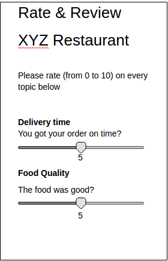

# Ratings

Users should be able to rate services (merchants..etc) on certain topics, also the service can rate users as well.

There will be a single question under every topic, Topics like:
- Quality
- Communication
- Location

Services will be divided into categories/sectors, like Bakery, Restaurant, next to organization types.
Category/Sector can be assigned to customers in the shop (also can be specified at customer signup page).
Categories/sectors must be configured in GIG-Mobile-CC. Just like "Review Notes" you must be able to create a
configuration that holds categories/sectors. Per app you need to be able to enable ratings and select a configuration
with categories/sectors. The must be a hard-coded sector named "users" which will be used by merchants to rate users.

Every topic can be rated with stars, e.g. from 0 to 10.

The rating screen (on the mobile app) will contain the topics related to every service category on a single page.

### Topics and questions configuration

For every service category/sector, topics and questions should be configured at the shop. Or the service will set them on its dashboard.
Or the topics will be created on the shop and the service will select which topic can be rated on its dashboard,.

### Where to show the ratings

There are two parts, the first one, where the user will rate the service and the service can rate the user, the other one is where those ratings will be shown and to whom.

#### Where to rate:
For example, the user can rate the service from its menu item on the app (via `Recommend` or e.g. a new `Rate & Review` menu item).
On the other hand, a service may rate the app user from its dashboard on the menu of `Order` if it's e.g. a restaurant or a new page for app user ratings.

#### Where to show the ratings and to whom
Service ratings (total and per topic ratings) should be shown to all of the app users (on service menu e.g. `About`), on the other hand, user ratings should be shown to the same category/sector services.

### Modeling

Namespace: ratings

* Topic
    - name/title (String)

* Question
    - user (parent service/app user)
    - service_sector or service_category (int)
    - topic_id (long)
    - content (String)
    - language (String)
    - rating (int)
    - for_app_user (bool)

#### Notes

- Ratings are based on topics, questions are there to help rating a certain topic, at the end, those ratings would be summed up and shown in some place for services or users. So at any time, we should be able to get the rating of a service or a user for certain topic or for all topics.

- If the questions/topics are generic (can be assigned to different service category/sector), rating field should be a separate model just to store the ratings of a service or app user for a certain topic (the user and rating fields should be removed from the `Question` model).

    * Rating
        - user (parent service/app user)
        - topic_id
        - value (int)

- Topics and questions should be translatable.

- A new field should be added to `Customer` model containing the sector/category.

#### Operations

* List all questions per service category (topics/questions that a service can be rated on)
* List all app user questions (topics/questions that an app user can be rated on)
* Rate a service or app user
* List total rating results of a service or app user

### Rogerthat Rate & Review flow step type

A new message flow step type (rate_review) should be create on rogerthat-platform/rogerthat-backend, a message flow containing the rating step alongside e.g. a review text will be generated dynamically for each service and will contain the topics/questions related to this service category.

This flow will list every topic with its question on a single screen.
